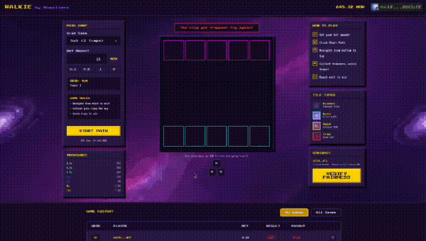

# WALKIE

**Provably Fair Tile-Reveal Game on Monad**

Built for [Mission X: Verifiably Fair](https://x.com/monad_dev/status/1999134435938312343)

<p align="center">
  
</p>

## Live Demo

**Play Now:** [walkie.monaliens.xyz](https://walkie.monaliens.xyz)

**Verify Fairness:** [walkie.monaliens.xyz/verify](https://walkie.monaliens.xyz/verify)

## The Concept

WALKIE removes the "trust us, it's fair" problem from gaming. Every trap placement, every reward tile, every game outcome is determined by **Pyth Entropy VRF** - and players can cryptographically verify it.

Navigate your King from start to goal. Each step reveals what's underneath:
- **Safe tiles** - Keep moving
- **Reward tiles** - Collect MON (0.1x to 10x multipliers)
- **Traps** - Game over, lose your bet

The catch? You can't see what's under a tile until you step on it. But here's the twist - you can **prove** the game didn't cheat you.

## How Provable Fairness Works

```
┌─────────┐     ┌─────────┐     ┌──────────┐     ┌──────────┐
│ PLAYER  │     │ BACKEND │     │ CONTRACT │     │ PYTH VRF │
└────┬────┘     └────┬────┘     └────┬─────┘     └────┬─────┘
     │               │               │                │
     │  Start Game   │               │                │
     │──────────────>│  Salt Hash    │                │
     │               │──────────────>│  Request VRF   │
     │               │               │───────────────>│
     │               │               │                │
     │               │               │<───────────────│
     │               │               │  VRF Callback  │
     │               │               │                │
     │   Play Game   │               │                │
     │──────────────>│  Reveal Salt  │                │
     │               │──────────────>│                │
     │               │               │                │
     │<──────────────│<──────────────│                │
     │  Verify & Pay │               │                │
```

**The Magic:**
1. Backend commits a **salt hash** before VRF is generated (can't change it later)
2. Pyth VRF provides **unpredictable randomness** (backend can't predict it)
3. Final seed = `keccak256(vrfSeed + backendSalt + gameId + VERSION)`
4. Neither party can manipulate the outcome alone

## Game Mechanics

| Grid | Tiles | Traps | Rewards |
|------|-------|-------|---------|
| 5×5  | 25    | 3     | 5-8     |
| 6×6  | 36    | 5     | 7-10    |
| 7×7  | 49    | 7     | 10-14   |

**Reward Multipliers:**
| Multiplier | Chance |
|------------|--------|
| 0.1x       | 35%    |
| 0.2x       | 25%    |
| 0.5x       | 20%    |
| 1x         | 12%    |
| 2x         | 5%     |
| 5x         | 2.5%   |
| 10x        | 0.5%   |

**Bet Range:** 0.1 - 10 MON

## Tech Stack

- **Smart Contract:** Solidity 0.8.22, UUPS Upgradeable Proxy (OpenZeppelin)
- **VRF Provider:** [Pyth Entropy](https://docs.pyth.network/entropy)
- **Frontend:** Next.js 16, React 19, TypeScript
- **Wallet:** Reown AppKit + Wagmi v2
- **Backend:** Express.js, MongoDB, WebSocket
- **Network:** Monad Mainnet (Chain ID: 143)

## Contract

**Address:** `0x7f7B8135d5D4ba22d3acA7f40676Ba9D89FDe731`

[View on Monad Explorer](https://monadexplorer.com/address/0x7f7B8135d5D4ba22d3acA7f40676Ba9D89FDe731)

## Why This Matters

Traditional games ask players to trust that RNG isn't rigged. WALKIE proves it isn't:

- **Transparent:** Every game's randomness source is on-chain
- **Verifiable:** Players can independently recalculate trap/reward positions
- **Trustless:** Smart contract enforces fairness - backend can't lie about tile contents
- **Open Source:** Verify the code yourself

## Local Development

```bash
# Install dependencies
npm install
cd frontend-next && npm install
cd ../backend && npm install

# Run frontend
cd frontend-next && npm run dev

# Run backend
cd backend && npm run dev

# Deploy contracts
npx hardhat run scripts/deploy.js --network monad
```

## Team

Built by [Monaliens](https://monaliens.xyz)

---

*Powered by Pyth Entropy VRF on Monad Mainnet*
